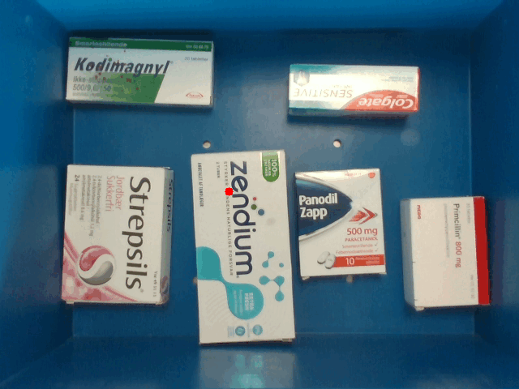
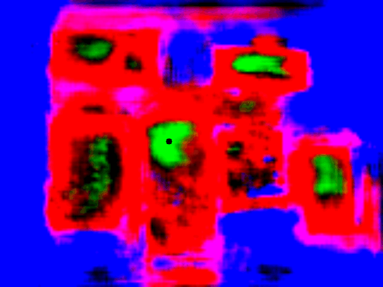

# Optimal Sequence Picking Using Deep Learning
This is the code used for our Master Thesis where we have used Deep Learning to try and learn the network an optimal picking sequence in the classical bin picking problem. Contrary to other methods and approaches we have tried to not use any depth data for our training and only feed the network RGB images.
We have limited our research to be with medical packaging and a suction gripper.\
Below you see our network prediction and affordance map of a picking sequence in a scene with scattered objects.

<p float="left">
  
   
</p>

Using the inference above we used an UR5e robot for the grasping as seen below.


Full details of our work can be read in our report found [here](link).\
We also have full simulation support for this in [RobWork](https://www.robwork.dk/). Requirements for compiling the project can be found below.

## Requirements
To run the code with C++, the project requires [PyTorch](https://pytorch.org/), [Open3D](http://www.open3d.org/), [OpenCV](https://opencv.org/), and [RobWork](https://www.robwork.dk/). Installation guides of these can be found below.

### **PyTorch**
Torch was installed through conda with [ollewelins](https://github.com/ollewelin/Installing-and-Test-PyTorch-C-API-on-Ubuntu-with-GPU-enabled) guide.

### **Open3D**
Open3D was compiled from [source](http://www.open3d.org/docs/release/compilation.html) with the following flags:
```bash
cmake -DBUILD_EIGEN3=ON -D BUILD_LIBREALSENSE=ON -DBUILD_GLEW=ON -DBUILD_GLFW=ON -DBUILD_JSONCPP=ON -DBUILD_PNG=ON -DGLIBCXX_USE_CXX11_ABI=ON -DPYTHON_EXECUTABLE=/usr/bin/python -DBUILD_UNIT_TESTS=ON ..
```

### **OpenCV**
OpenCV was a standard install with `sudo apt install libopencv-dev` or compiled using the the guide on the [OpenCV official website](https://docs.opencv.org/master/d7/d9f/tutorial_linux_install.html).

### **RobWork**
RobWork was a standard install following the guide on the [RobWork official website](https://www.robwork.dk/installation/ubuntu/).

## Compiling and running the code
### **Building the binary file for inference**
The inference is seperated from RobWork because of compatibility issues and needs to be compiled seperately. The compiled binarry file need to be located in the binary folder. This can be done with the following commands
```bash
cd RobWork/cpp/inference_bin_generator/build
cmake ..
make -j4
cp ../bin
```

NOTE: This should also be copied to the `physical-implementation/bin` to run on the UR5e.

### **Building and running the simulation**
Now the project can be built with the following commands
```bash
cd RobWork/cpp/build
cmake ..
make -j4
```

To run the project, the following command can be used
```bash
cd RobWork/cpp/build
./main --model_name <model_name> --file_name <file_name> --folder_name <folder_name> --result_file_name <result_file_name>
```

The only flag you should provide is the `--model_name` to choose what model to do inference with. However, the flags mean the following:
- `--model_name` : Name of the model you want to use. Our final network is called `unet_resnet101_10_all_reg_jit.pt` and can be found [here]() along with our other models.
- `--file_name` : The prefix for saved files. If empty model name is used.
- `--folder_name` : The name of the folder to save images in. If empty model name is used.
- `--result_file_name` : Name for csv file containing results.

The images can be found in the `images` folder.

### **Building and running on the UR5e**
Same procedure as in the simulation except you have to be in another directory
```bash
cd physical-implementation/build
```

Before running make sure you have a connection to the UR5e and change the IP accordingly.


## Synthetic Data Generation 
We have generated our own data using blender on top of the dataset from Zeng et al. found [here](https://vision.princeton.edu/projects/2017/arc/). You can generate your own data by running the `generate_image.sh` in the `blender` folder. Run the following commands to see how to call the script.

```bash
cd blender
chmod +x generate_image.sh
./generate_image.sh -h
```

Items can be added or removed by removing them from items collection in `synthetic_data_generator.blend` which must be opened with blender.